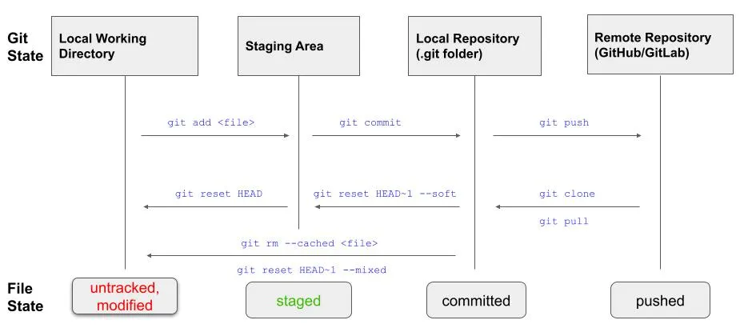
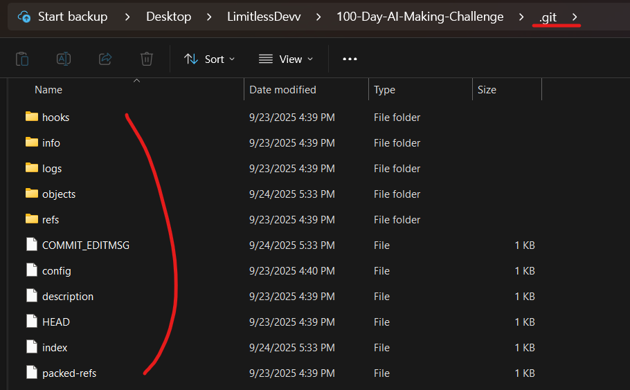
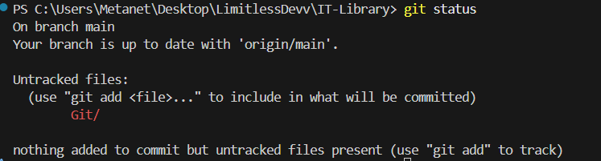
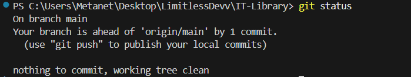

# Basic Git Commands
## Git Workflow Overview

## 1. git init
`git init` command creates a new Git repository or reinitates an existing one.

When you run the command, your current directory becomes a Git repository, allowing you to track its changes. It adds a hidden .git folder in the directory, where Git store all the metadata and history of your project. Without it, your project is just a normal folder, not a Git repository.

## 2. git clone
`git clone` command copies a Git repository from on location to another. It usually copies an existing repository from remote servers like GitHub or GitLab to your local machine.

`git clone <repository-url> <new-folder-name>
`

## 3. git status
`git status` command shows the current state of your working directory and staging area.
1. Shows branch info

    : Tells you which branch you are on and if it's ahead/behind the remote branch

    Git compares your local branch with the remote branch at the commit level, not based on uncommitted changes in your working directory.
   
    

    After commit
    
2. Shows untracked files
    
    : New files that Git isn't tracking yet
    
3. shows staged changes

    :  Files added with  git add that are ready to be committed
4. Shows unstaged changes

    : Files that have been modified but not yet staged

## 4. git add
`git add` command adds your changes to the staging area. It tells Git that the repository should update these changes once the user runs the commit command
- `git add .` : stages the changes made to all files
- `git add <file_name>` : includes only the changes made to a specific file in the staging area

## 5. git commit
`git commit` command saves the changes you have made to the local repository. Each time you run git commit, Git creates a snapshot of your repository at that point. This allows you to roll back to a previous commit whenever needed.

`
git commit -m "commit_message"
`