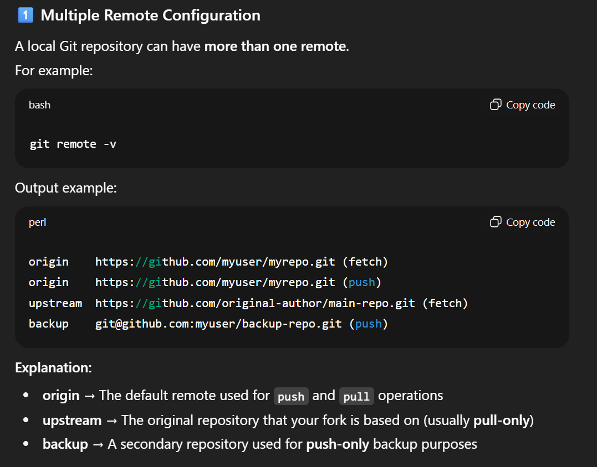

# Basic Git Commands
## Git Workflow Overview

## Terminology
`branch` : git에서 코드의 버전 흐름을 분리하는 선. 독립적인 작업 공간. git의 모든 버전은 commit 단위로 저장되는데, 브랜치는 그 커밋을 가리키는 이름.

`origin` : 기본 remote repository 이름. local에서 fetch, pull, push 하는 기본 대상이 이 origin. 즉 내 git이 바라보는 remote 서버의 기본 주소(alias)
git remote -v : 현재 로컬 저장소가 어떤 remote를 바라보는지 확인 가능
아무 인자 없이 git push, git pull 하면
git push origin <현재 브랜치> 와 동일하게 동작

## 1. git init
`git init` command creates a new Git repository or reinitates an existing one.

When you run the command, your current directory becomes a Git repository, allowing you to track its changes. It adds a hidden `.git` folder in the directory, where Git store all the metadata and history of your project. Without it, your project is just a normal folder, not a Git repository.

## 2. git clone
`git clone` command copies a Git repository from one location to another. It usually copies an existing repository from remote servers like GitHub or GitLab to your local machine.

`git clone <repository-url> <new-folder-name>
`

## 3. git status
`git status` command shows the current state of your working directory and staging area.
1. Shows branch info

    : Tells you which branch you are on and if it's ahead/behind the remote branch

    Git determines the "ahead" or "behind" status by comparing your local branch with this just-updated remote-tracking branch (e.g., origin/main).
    
    But, `git status` does not connect to the remote repository in real-time every time you run it. Instead, it determines the status based on the information it already has from your last `git fetch`.
    
    Tthe `git fetch` command downloads all the latest history and changes from the remote repository but does not automatically merge them into your working branch.

    

    After commit
   
    

2. Shows unstaged changes

    : Files that have been modified but not yet staged

3. Shows staged changes

    :  Files added with `git add` that are ready to be committed

4. Shows untracked files
    
    : New files in your working directory that Git has not been told to manage yet. They are in the Working Directory but have never been added to the Staging Area.
    
    To include them in your project, you must first move them to the staging area using the `git add` command.You must add them to start tracking them.

## 4. git add
`git add` command adds your changes to the staging area. It tells Git that the repository should update these changes once the user runs the commit command
- `git add .` : stages the changes made to all files
- `git add <file_name>` : includes only the changes made to a specific file in the staging area

## 5. git commit
`git commit` command saves the changes you have made to the local repository. Each time you run git commit, Git creates a snapshot of your repository at that point. This allows you to roll back to a previous commit whenever needed.

`
git commit -m "commit_message"
`

## 6. git branch

## git fetch
`git fetch <remote repo> <local branch>`
뒤에 2개 인자 생략 할 경우, remote repository는 main 이고, local branch 는 현재 내가 위치한 branch